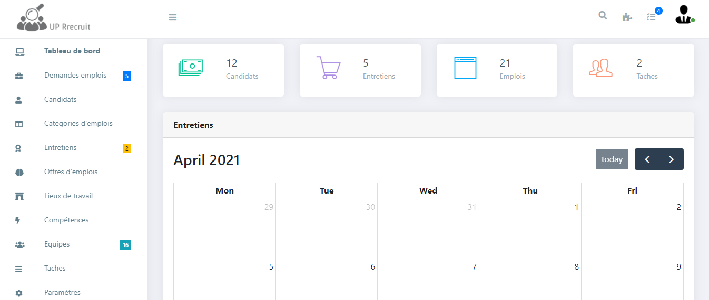

## Introduction

Up recruit is a web application that allows you to manage the staff recruitment process for companies.

## Informations
-   Status: under development
-   Version: 1.0
-   Sector: industry
-   Created: November 2020
-   Last updated: December 2020

## Table of contents
* [Documentation](#general-info)
* [Demo](#demo)
* [Screenshots](#screenshots)
* [Technologies](#technologies)
* [Setup](#setup)
* [Features](#features)
* [Status](#status)
* [Contact](#contact)
* [License](#license)

## Documentation
https://github.com/aniskchaou/UPRECRUIT-FRONTEND-ADMIN/wiki

## Demo
https://up-recruit.herokuapp.com/

## Screenshots

## Technologies
* Spring boot
* React.js

## Setup

## Features
 -  Select products by category
-   View the product details
-   Add a product to the cart
-   Manage cart
-   Search for products
-   Check out the product

  

## Contact
contact@delta-dev-software.com

## License
<a href="license.txt">MIT License</a>